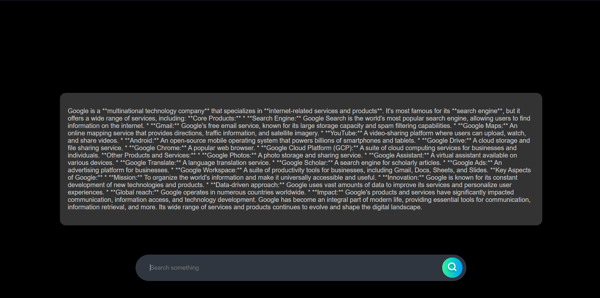

# Search Engine Project 

## Project Overview
This is a minimalist search engine project built using HTML, CSS, and JavaScript for the frontend and Express.js for the backend. It integrates Google's Gemini API to fetch and display search results in a simple, user-friendly manner.

## Features
- **Search Input**: Users can search for terms using a clean input box with a search button.
- **Loading Animation**: A minimal loader is displayed while fetching search results.
- **Gemini API Integration**: Searches are processed using Google's Gemini API, and results are displayed in a minimalist format.

## Project Structure
- `index.html`: The main HTML file containing the search box, loading animation, and result display section.
- `style.css`: Styles for the minimalist UI, including search bar design and loader animation.
- `script.js`: Handles user interactions on the frontend, sends search queries to the backend, and displays results.
- `server.js`: An Express.js server that processes search queries, interacts with the Gemini API, and returns responses.

## Setup Instructions
1. **Clone the repository:**
   ```bash
   git clone https://github.com/search.git
   cd search-engine-project
   ```

2. **Install dependencies:**
   ```bash
   npm install
   ```

3. **Set up environment variables:**
   Create a `.env` file in the root directory and add your Gemini API key:
   ```env
   GEMINI_API_KEY=your_api_key_here
   ```

4. **Run the server:**
   ```bash
   node server.js
   ```

5. **Open in browser:**
   Open `http://localhost:3000` in your browser.

## Screenshots

### Landing Page


### Chat Interface


